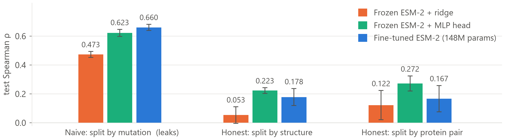

# Predicting ΔΔG of binding from sequence with fine-tuned ESM-2

Fine-tuning ESM-2 to predict the change in protein–protein binding free energy caused by a
single interface mutation, evaluated on SKEMPI 2.0 — and measuring how much of the apparent
performance is leakage.

**Headline:** on a split that lets the model memorise complexes, fine-tuning scores Spearman
**0.66**. On an honest complex-level split, the same model scores **0.18**, and a frozen
backbone with a 0.49M-parameter head does at least as well. On antibody–antigen complexes
specifically, the fine-tuned model's ranking comes out **anti-correlated** with the
measurements.

A three-page summary of the whole project is in
[`report/esm2-skempi-report.pdf`](report/esm2-skempi-report.pdf).

## Motivation

Affinity maturation is a search over interface mutations, and the quantity being searched over
is ΔΔG of binding. Most of that search still happens by building the variants and measuring
them. A model that ranks candidate substitutions *before* they are expressed does not have to
be accurate in kcal/mol to be useful — it has to put the right mutations near the top of the
list. That is a much weaker requirement than calibration, and a much more testable one.

Protein language models are the obvious thing to reach for: they are cheap, they need no
structure, and they already encode a great deal about which residues belong where. Whether they
encode anything about what holds an *interface* together is a different question. This repo
tries to answer it honestly, and the short version is: less than a headline number suggests. The
distance between those two statements turns out to be almost entirely a matter of how the test
set was built, which is why the split — not the architecture — is the subject of this repo.

## Problem

ΔΔG of binding is the quantity you actually want when you ask "will this mutation make my binder
better or worse". It is defined as ΔG(mutant) − ΔG(wild-type), where ΔG = RT·ln(K<sub>d</sub>);
positive means destabilizing, i.e. weaker binding.

SKEMPI 2.0 is the standard experimental benchmark: measured K<sub>d</sub> values for mutations in
protein complexes of known structure. After filtering to single-point mutations with clean
(non-inequality) affinity measurements at both wild-type and mutant, this repo works with
**4,829 mutations across 316 complexes**, reduced to **4,814 across 314** by a sequence-length
policy (below).

Scope for v1 is deliberately narrow — sequence-only, single-point, 150M backbone. What is *out*
is a decision, not an oversight; see [DECISIONS.md](DECISIONS.md).

## Method

**Siamese ESM-2.** One shared backbone encodes the wild-type complex and the mutant complex.
Because the weights are shared, both embeddings live in the same space, so their difference is
meaningful — which matters, since ΔΔG is about what *changed*.

```
wt sequence  ─┐
              ├─→ [shared ESM-2] ─→ mean-pool ─→ ┐
mut sequence ─┘                                  ├─→ concat[wt, mut, mut−wt] ─→ MLP ─→ ΔΔG
                                                 ┘
```

Head: `Linear(hidden×3, 256) → ReLU → Dropout(0.1) → Linear(256, 1)`.
Loss: **Huber (δ=1.0)**, chosen over MSE because 11% of the dataset exceeds |ΔΔG| > 3 kcal/mol
and those are real measurements, not noise.
Pooling is mask-aware mean-pooling; position-specific pooling at the mutated residue is a
deliberate v2 (`dataset.py` already emits `mutation_token_index` for it).

**Two baselines exist so that the fine-tuned model cannot fail silently:**

1. **Zero-shot masked-marginal** — no training at all. Establishes the floor.
2. **Frozen embeddings + head** — backbone frozen, only a small head trained. Establishes what
   the pretrained representation already knows.

Build order was zero-shot → frozen probe → fine-tune, each one insurance against the next
silently breaking.

**Training setup.** Full fine-tune of `facebook/esm2_t30_150M_UR50D` (148.6M trainable
parameters, of which the head is 0.49M); AdamW at lr 2×10⁻⁵; bf16 autocast with no GradScaler,
since bf16 keeps fp32's exponent range; batching by **token budget** (4,096 padded tokens per
batch) rather than by a fixed example count, because complexes span 60–2,048 tokens and a fixed
batch size makes peak memory depend on which complexes a batch happens to draw. Ten epochs
maximum, early stopping with patience 3, selecting on **validation Spearman rather than
validation loss** — the two genuinely diverge, because Huber keeps improving absolute
calibration long after the rank ordering has stopped changing.

On one RTX 4090 (24 GB) a run is **179 s/epoch, ≈25 minutes end to end**; the 15 replicate runs
behind the tables below are 6.2 GPU-hours in total. 650M was measured and rejected: the siamese
design calls the backbone twice per step, so even with gradient checkpointing it needs 26.9 GB
against a 24 GB card and runs 33× slower once traffic spills to host memory.

## The methodological point that matters most

**Mutations of the same complex are highly correlated.** Split SKEMPI's rows at random and nearly
every complex in the test set also appears in training, so the model can memorise a complex from
its training mutations and "predict" held-out mutations of that same complex. That does not
measure what you care about.

This repo splits **groups**, never rows, and reports three definitions side by side:

| split | groups | what it is |
|---|---|---|
| `split_mutation` | — | naive row-level. **Leaks by construction.** The contrast case, never the headline. |
| `split_pdb_id` | 313 | group by structure. The literal reading of "complex-level". |
| `split_hold_out_proteins` | 152 | SKEMPI's curated grouping. Strictest — also catches one protein pair appearing under several PDB entries. |

`tests/test_splits.py` enforces the invariant as 14 real tests. The gap between the columns below
**is the result**, not an embarrassment.

## Results

Test Spearman, **mean ± std over 5 replicates** (3 training seeds at a fixed partition, 3 split
seeds at a fixed training seed, overlapping at split42/seed42). Spearman is the primary metric —
rank order matters more than calibration for screening.

| Model | `split_mutation` (leaky) | `split_pdb_id` | `split_hold_out_proteins` |
|---|---|---|---|
| Zero-shot ESM-2 150M | −0.082 | +0.005 | −0.097 |
| Frozen embeddings + ridge | 0.473 ± 0.021 | 0.053 ± 0.057 | 0.122 ± 0.102 |
| Frozen embeddings + MLP | 0.623 ± 0.024 | **0.223 ± 0.020** | **0.272 ± 0.053** |
| Fine-tuned ESM-2 150M | **0.660 ± 0.021** | 0.178 ± 0.059 | 0.167 ± 0.091 |



Reading left to right is reading the cost of an honest split. Note the *within-group* order
too: on the leaky split more trainable parameters help monotonically; on both honest splits
that ordering disappears.

Zero-shot is a single deterministic run and is ranking-only, so it has no error bars and no RMSE.
Its numbers are all ≈0 on every split, which is what makes it a free control: the three test sets
are of similar intrinsic difficulty, so the gaps in the rows below are caused by *training*, not
by unequal splits.

**Fine-tuning wins on exactly one split — the leaky one.** Paired on identical partitions,
fine-tune minus frozen-MLP probe:

| split definition | n | mean diff | 95% CI | p | verdict |
|---|---|---|---|---|---|
| `split_mutation` (leaky) | 5 | **+0.038** | [+0.003, +0.072] | **0.038** | fine-tune genuinely better |
| `split_pdb_id` | 5 | −0.045 | [−0.133, +0.043] | 0.229 | not distinguishable |
| `split_hold_out_proteins` | 5 | −0.105 | [−0.256, +0.045] | 0.124 | not distinguishable |

So: **the only split where 148M trainable parameters demonstrably beat a frozen backbone plus a
0.49M head is the one that rewards memorisation.**

The training curves say why, and they say it across all five replicates rather than in one
illustrative run. On `split_mutation` the best epoch is the **last** one in all five (validation
ρ 0.17–0.35 at epoch 0 rising to 0.62–0.68 at epoch 9): the run never signals a stop, because
validation holds other mutations of complexes already in training, and memorising an interface
is indistinguishable from learning ΔΔG. On `split_pdb_id` the best epoch is erratic — 3, 3, 7, 9,
9 — and early stopping fires before ten epochs in two runs. On `split_hold_out_proteins`
**three of five replicates peak at epoch 0**: the model is at its best before it has learned
anything transferable from the training complexes at all. Same model, same hyperparameters, same
data — the only variable is whether the split rewards memorising a complex.

**Why the zero-shot floor is a floor.** Scoring the mutated chain *alone* and scoring it inside
the full concatenated complex agree at ρ = **0.888** — deleting the entire binding partner barely
changes the ranking. ESM-2's masked-marginal is effectively blind to the binding partner: it
scores whether a residue belongs in its chain, not whether it holds an interface together.
Reproduce with `--context {complex,chain}`.

Reproduce every number here with `python -m src.replicates`.

## The antibody–antigen subset

SKEMPI labels antibody–antigen complexes, so this breakdown is free — and it is the subset that
matters most if you care about binder engineering. Paired, same 5 replicates:

| | `split_pdb_id` (honest) | `split_mutation` (leaky) |
|---|---|---|
| Frozen embeddings + MLP | **+0.264 ± 0.052** | +0.551 ± 0.042 |
| Fine-tuned ESM-2 150M | **−0.065 ± 0.142** | +0.497 ± 0.083 |
| paired diff (ft − probe) | **−0.330**, 95% CI [−0.540, −0.119], **p = 0.012** | −0.054, [−0.121, +0.012], p = 0.086 |

On all test rows fine-tuning and the probe are statistically indistinguishable. **On antibody
complexes they are not: fine-tuning is reliably worse, and its Spearman is below zero** — the
ranking is anti-correlated with measured ΔΔG. All five replicate pairs are negative.

Three caveats, stated rather than buried:

- This subset was **pre-specified** before any results existed, so it is a planned comparison
  rather than a subgroup found by searching. It is still one subgroup among several computed in
  `error_analysis`.
- **`split_hold_out_proteins` cannot support this claim.** Its test set holds only 6 AB/AG rows,
  below the 10-row minimum, so the metric is correctly omitted there. The claim rests on
  `split_pdb_id` alone.
- The AB/AG row count is **189–230**, not fixed, because split seeds re-partition whole complexes.

## Limitations

- **Sequence-only.** No structural features, despite SKEMPI shipping structures. A
  structure-aware model should beat this, and comparing against FoldX-style methods on their own
  terms is not possible here.
- **Single-point mutations only.** 1,973 multi-point rows are dropped. ΔΔG is not additive across
  mutations in general, so the model says nothing about epistasis.
- **The honest numbers are modest** — Spearman ~0.18–0.27. This repo reports them because a
  modest correctly-reported number on an honest split is worth more than an inflated one from a
  leaky split. The leaky 0.66 is included to show exactly how much a split choice is worth.
- **Mean-pooling discards position.** A whole-sequence mean is a weak signal for a change of one
  residue in up to 2,048 — plausibly the largest architectural limitation here, and the first
  thing on the list below.
- **Fine-tuning is 2–4× more variable than the probe** (std 0.048–0.113 vs 0.016–0.063). Fixing
  the seed does not fix this: the identical config gave 0.148 and 0.225 on two different days
  from CUDA kernel nondeterminism alone. Never quote a single run.
- **127 inequality rows dropped.** SKEMPI's `Affinity_*_parsed` columns silently strip `<` / `>`
  and return a bare number, so these must be filtered on the raw columns. Censored regression
  would use them properly; that is out of scope for v1.
- **Sequence length capped at 2048 tokens**, excluding 2 complexes and 15 rows (0.3%). Rows
  between 1024 and 2048 tokens (1.6%) run past ESM-2's pretraining crop — rotary embeddings
  extrapolate, but quality is not guaranteed. Truncation was rejected because at a 1024 cap the
  mutation site itself falls outside the window for 77 rows, making `mut_emb − wt_emb` exactly
  zero while the model still trains on a real label.
- **Splits are size-aware, not uniformly random.** Group sizes span three orders of magnitude,
  and filling `train` first sends the large well-studied complexes there. Val and test therefore
  hold *smaller, less-studied* complexes — arguably the realistic generalization target, but a
  structured train/test difference rather than a purely random one. It is also why the antibody
  subset is thin on the strictest split.

## Next steps

Ordered by expected value. The results above diagnose overfitting and instability, so the goal is
to cut variance, not only to raise the mean:

1. **Position-specific pooling at the mutated residue**, concatenated with the mean-pooled
   context. `dataset.py` already carries the token index. Targets the limitation the honest
   splits expose most directly.
2. **LoRA on the 150M backbone as regularisation** — a small adapter should shrink the replicate
   spread that makes single runs unreportable, and it doubles as the prerequisite for 650M, which
   does not fit on a 24 GB card under full fine-tuning. Alongside it, a lower learning rate or
   freezing the lower N layers, aimed at the epoch-0 peak on the strictest split.
3. **Diagnose the antibody-subset inversion** before trusting any antibody number: is CDR
   sequence variability being read as noise, or are the loops out of distribution for a general
   protein language model?
4. **Structural features** — relative solvent accessibility and interface contact counts are
   cheap given SKEMPI's structures, and would test whether the ceiling here is the representation
   or the task.

## Decisions

See [DECISIONS.md](DECISIONS.md) for why the split, loss, pooling and backbone size are what
they are.

## Reproduce

Requires Python ≥3.10 and, for training, an NVIDIA GPU. Developed on Windows 11 with Python 3.14
and an RTX 4090 (CUDA 13.0).

```powershell
git clone https://github.com/DermIQ-admin/esm2-ddg-binding
cd esm2-ddg-binding

python -m venv .venv
.venv\Scripts\activate
pip install -r requirements.txt
```

`requirements.txt` pins the CUDA build of PyTorch via `--extra-index-url`. For a CPU-only
install, drop that line and the `+cu130` suffix on `torch`.

Verify the GPU before training — `torch.cuda.is_available()` alone can return True on a broken
driver/runtime pairing, so this runs a real matmul against the CPU:

```powershell
python -m src.utils
```

Data pipeline (`data/processed/` is committed, so this is only needed to regenerate):

```powershell
python -m src.data.download        # SKEMPI 2.0 into data/raw/ (not committed)
python -m src.data.parse_skempi    # parse, compute ΔΔG, filter
python -m src.data.splits          # the three split definitions
python -m pytest tests/ -q         # 14 tests: enforces the no-leakage invariant
```

Baselines:

```powershell
python -m src.baselines.zero_shot --backbone facebook/esm2_t30_150M_UR50D
python -m src.baselines.zero_shot --backbone facebook/esm2_t30_150M_UR50D --context chain
python -m src.baselines.linear_probe --backbone facebook/esm2_t30_150M_UR50D
```

Fine-tuning — **one model per split definition**, because the three definitions disagree about
which rows are held out. A row in `split_pdb_id`'s test set is usually in `split_mutation`'s
training set, so a model trained on one definition has contaminated numbers on the other two.
`evaluate.py` marks them `<- INVALID` rather than printing them as if they counted.

```powershell
python -u -m src.train --split-column split_pdb_id
python -u -m src.train --split-column split_hold_out_proteins
python -u -m src.train --split-column split_mutation
```

Low-rank adapters instead of full fine-tuning — 1.11M trainable parameters rather than
148.6M. Note the learning rate is not inherited: LoRA initialises its B matrix to zero, so the
adapters start as an exact no-op and need a rate about an order of magnitude higher to move at
all. `--lora` therefore defaults to 2e-4 rather than the config's 2e-5, and prints which it used.

```powershell
python -u -m src.train --split-column split_pdb_id --lora
```

Use `python -u`. Piping buffers stdout and short epoch lines never fill the buffer, which makes a
long run completely unobservable.

Replicates and the aggregate tables:

```powershell
python -m src.data.splits --random-state 43     # writes splits_seed43.csv
python -m src.data.splits --random-state 44

# Two variance sources, measured separately. --seed varies training
# stochasticity at a fixed partition; --splits-file re-partitions the
# complexes at a fixed training seed. Split variance exceeds training
# variance on most cells, which is why both are run.
python -m src.train --split-column split_pdb_id --seed 43
python -m src.train --split-column split_pdb_id --splits-file splits_seed43.csv

python -m src.replicates                         # every table in this README
```

## Related work

This is a portfolio project rather than an attempt at state of the art, and the task is well
studied. The work worth knowing about, and how this repo sits relative to it:

- **Zero-shot PLM scoring** — Meier et al. 2021, *[Language models enable zero-shot prediction
  of the effects of mutations on protein function](https://www.biorxiv.org/content/10.1101/2021.07.09.450648v1.full)*
  (ESM-1v), established scoring a mutation by the log-odds ratio at the masked mutated
  position. Implemented here as the floor, and the context ablation above measures *why* it is
  only a floor for **binding** specifically.
- **MINT** — Ullanat, Jing, Sledzieski & Berger, *[Learning the language of protein–protein
  interactions](https://pmc.ncbi.nlm.nih.gov/articles/PMC11956943/)* (Nature Communications,
  2025). Keeps self-attention within chains and adds cross-chain attention blocks to ESM-2, and
  reports the strongest sequence-only result on SKEMPI's binding task. This is the direct answer
  to the blindness the ρ = 0.888 ablation measures, and the natural next architecture if the
  pooling fix is not enough.
- **AbTune** — Xu & Bonvin, *[AbTune: layer-wise selective fine-tuning of protein language
  models for antibodies](https://academic.oup.com/bib/article/27/4/bbag374/8732927)* (Briefings
  in Bioinformatics, 2026). Finds that depth-selective fine-tuning **consistently beats
  full-depth fine-tuning**, optimally tuning 50–75% of layers. That is the closest external
  check on the central result here: full fine-tuning of all 148M parameters failing to beat a
  frozen backbone is consistent with their finding, and it is why "freeze the lower N layers"
  is on the next-steps list. Their mutation-effect set is 47 antibody–antigen complexes drawn
  from SKEMPI v2, AB-Bind and AbDesign, so it is not directly comparable to the AB/AG numbers
  above.
- **ProBASS** — Gurusinghe, Wu, DeGrado & Shifman, *[ProBASS — a language model with sequence
  and structural features for predicting the effect of mutations on binding
  affinity](https://pmc.ncbi.nlm.nih.gov/articles/PMC12151015/)* (Bioinformatics, 2025).
  Concatenates ESM-2 sequence embeddings with structural embeddings into a 1,792-feature vector
  and fits CatBoost, on SKEMPI plus their own measurements.
- **3D-ΔΔG** — *[A dual-channel prediction model for protein–protein binding affinity changes
  following mutation based on protein 3D structures](https://onlinelibrary.wiley.com/doi/10.1002/prot.26837)*
  (Proteins, 2025; [code](https://github.com/ShiLab-GitHub/3D-DDG)). A PLM over the side-chain
  sequence and a graph attention network over structure, fused in a dual-channel module.
- **Li et al. 2025** — *[Accurate prediction of protein tertiary and quaternary stability using
  fine-tuned protein language models and free energy
  perturbation](https://pmc.ncbi.nlm.nih.gov/articles/PMC12345697/)* (IJMS;
  [code](https://github.com/ejp-lab/EJPLab_Computational_Projects/tree/master/ProteinStability/ddG)).
  The closest architectural neighbour: wild-type and mutant concatenated-chain complexes through
  the same model, and a 70-15-15 split that keeps mutations of the same protein domain in one
  set. They separate the chains with a dedicated break token; this repo concatenates with none,
  since ESM-2 has no chain-break token in its vocabulary.
- **Seq2Bind** — Ma et al., *[Seq2Bind webserver for binding site prediction from sequences using
  fine-tuned protein language models](https://academic.oup.com/nargab/article/7/4/lqaf154/8340159)*
  (NAR Genomics and Bioinformatics, 2025). Fine-tunes ProtBERT, ProtT5, ESM-2 and a BiLSTM on
  SKEMPI 2.0, with binding-site identification as the headline application.

**On comparing numbers across these papers.** They report under a range of split definitions,
and the gap measured here — 0.66 against 0.18 from one model, one dataset and one set of
hyperparameters — is large enough to swamp the differences between methods. Li et al. above is
the useful comparison precisely because their split rule is stated and is the same kind as this
one. Reading a SKEMPI leaderboard without first checking how each entry built its test set is
not a meaningful exercise, which is the argument this repo exists to make concrete.

## Data and attribution

Affinity measurements and the curated `hold_out_proteins` / `hold_out_type` groupings are from
**SKEMPI 2.0**, and the derived values in `data/processed/` (`kd_wt_m`, `kd_mut_m`, `ddg`) are
computed from them:

> Jankauskaitė J., Jiménez-García B., Dapkūnas J., Fernández-Recio J., Moal I.H. (2019).
> SKEMPI 2.0: an updated benchmark of changes in protein–protein binding energy, kinetics and
> thermodynamics upon mutation. *Bioinformatics* 35(3):462–469.
> <https://life.bsc.es/pid/skempi2/>

`data/raw/` is not committed — `src/data/download.py` fetches it. Model weights are
[`facebook/esm2_t30_150M_UR50D`](https://huggingface.co/facebook/esm2_t30_150M_UR50D).

## License

MIT — see [LICENSE](LICENSE). Covers the code in this repository, not the SKEMPI data.
